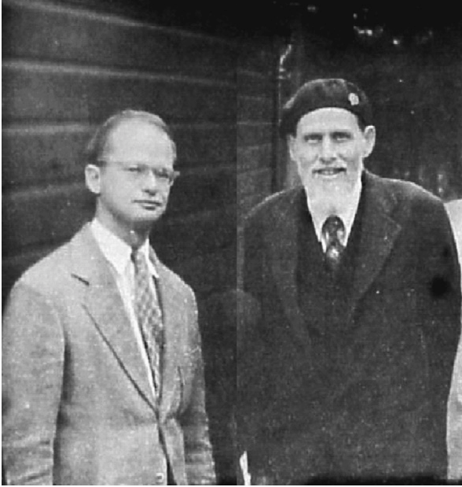

# 1. A neurális hálózatok kutatásának kezdetei #

Azt már az 1800-as évek legvégén felismerték, hogy agyunkban neuronsejtek hálózata található, melyek elektromos jeleket továbbítanak egymásnak. A 20. század első felében ennek felépítéséről egyre több részletet derítettek ki, így hamarosan felmerült, hogy ezt leutánozva akár gondolkodásra képes gépeket is készíthetnénk.

Az első elméleti modellt már 1943-ban megalkották, ez volt a perceptron. (McCulloch és Pitts) Ekkor még a legelső számítógép is csak tervezési fázisban volt, két évvel később készült el, így érthető, hogy a perceptron az elméletileg elképzelhető legegyszerűbb modell volt, hogy legyen esély közeli megvalósítására. Annak analógiájára, hogy tüzel-e a neuronsejt vagy sem, a perceptron kimenetén kétféle érték jelenhetett meg (0 vagy 1). Ahogy sejtjeink esetén is, minden perceptron sok bemenettel rendelkezett, mely vagy kívülről hozott be egy értéket (bemeneti neuron), vagy egy másik perceptron kimenetéről jött, így ezek az értékek is 0-ák vagy 1-ek lehettek. A perceptron maga annyit csinált, hogy megszámolta, hogy hány bemenetén érkezett 1 (vagy másképp nézve összeadta a számokat), és ha ez elért egy bizonyos küszöbértéket, akkor kimenetén 1 lett, különben 0.
https://en.wikipedia.org/wiki/Perceptron

|  |   |
|:----------------------------------------------------------:|:-------------------------------------------------:|
|   Walter Pitts és Warren Sturgis McCulloch (1949 körül)    |                    Perceptron                     |

Természetesen a rendszert be kellett valahogy hangolni, ami ezeknek a küszöbértékeknek a megtalálásából állt. Ezek voltak a paraméterek. (Ennél a modellnél annyi darab paraméter volt, ahány neuron.)
 
1949-ben Hebb továbbfejlesztette az elméleti modellt. Felismerte, hogy a neuronsejtek szinapszisai megváltoztatják a beérkező jelet, ezért a neuron bemeneteire súlyokat, vagyis szorzókat helyezett el. Az input értéket meg kellett szorozni a súllyal, és az így kapott értékeket minden bejövő lábon összegezve állt elő az érték, ami vagy a küszöb alatt, vagy felett volt. Így a paraméter már nem csak a köszöbérték volt, hanem minden egyes bejövő lábon egy-egy szorzó is. (Ez ekvivalens azzal, hogy a küszöb mindig 0, és a bejövő felszorzott értékek összegét eltoljuk valamivel, vagyis hozzá kell adni egy pozitív vagy negatív értéket: a biast, magyarul eltolást). Hebb ezen kívül egy tanulási mechanizmust is kitalált, vagyis hogy hogyan lehet megtalálni a megfelelő paramétereket.

|  |  |
|:------------------------------------------:|:----------------------------------------------------:|
|             Donald Olding Hebb             |                 Hebb-féle perceptron                 |

1951-ben Minsky 40 perceptron véletlenszerűen elrendendezett hálózatát építette meg, amit egy labirintusból való kitalálásra tanítottak be. Nem maradt fenn a berendezés, és képességeiről se sokat tudni, mindenesetre valószínűleg ez volt az első perceptron megvalósítás.
https://historyof.ai/snarc/

Ne feledjük, hogy ebben az évtizedben az éppenhogy megszülető hagyományos számítástechnika rohamos fejlődésnek indult. A szobányi méretű elektroncsöves berendezések helyét átvették a kisebb, gyorsabb, megbízhatóbb tranzisztor alapúak. Megszülettek az első procedurális programnyelvek is, és az 50-es évek végére már számtalan feladatot sikeresen megoldottak. Eközben a mesterséges intelligencia kutatása jóval kisebb figyelmet kapott. Kevés kutató foglalkozott vele, és kevésbé látszott valamiféle gyakorlati haszon.

Ráadásul a neuronhálózatokat utánozó úgynevezett konnekcionista elméletek mellett a mesterséges intelligencia egy másik lehetőségében is sokan hittek, ez a szimbolikus mesterséges intelligencia. Itt szabályok lefektetését, logikai kapcsolatok betaplálását, keresésen alapuló algoritmusokat használtak, és így remélték, hogy az emberi képességekhez közelítő megoldásokat találnak. Ez a vonulat termelte ki például a 70-es években létrehozott Prolog programnyelvet is. (Tanították is nekünk a 90-es évek közepén.) A gyakorlati megvalósításokat ma már inkább csak szakértői rendszereknek nevezik, melyek valamiféle tanácsot, vagy lehetőségek listáját tudták produkálni. Úgy hívták, hogy mesterséges intelligencia, de semmi olyasmit nem csináltak, amit ma annak neveznénk.

Utólag könnyű okosnak lenni, hogy a konnekcionista irányzat lesz a gyümölcsözőbb, de több évtizednek kellett eltelnie, mire ez világossá vált. De menjünk vissza az 50-es évekbe, és nézzük tovább, mi történt ezen az úton!

Ekkoriban a kevés kutató közt az egyik legelhivatottabb Frank Rosenblatt volt, aki 1958-ban épített perceptron alapú rendszert. Elkészült ennek szoftveres szimulációja, és egy elektroncsövekből álló hardveres megvalósítás is, melyet Mark I Perceptronnak neveztek. Ez a szekrénysor méretű eszköz egy 400 fotocellából álló kamera jelét dolgozta fel, ami egy 20 x 20-as képet érzékelt. Fekete háttér elé tett fehér alakzatokat mutattak neki, vagyis így minden fotocella vagy egy fekete, vagy egy fehér pontot látott. 0-át vagy 1-et. Az ennek megfelelő elektromos jelet 400 darab perceptronba vezették. (Mindegyik fotocella képét mindegyik perceptronhoz.) Ez volt a bemeneti réteg. Ennek a 400 perceptronnak a kimenete néhány további perceptron bemenetére került, és azok kimenete adta az eredményt. A paramétereket potméterek tekergetésével lehetett beállítani.
https://www.ling.upenn.edu/courses/cogs501/Rosenblatt1958.pdf

|  |  |
|:---------------------------------------------------------------------:|:-------------------------------------------------------------:|
|                Frank Rosenblatt és a Mark I Perceptron                |      Frank Rosenblatt és a Mark I perceptron szerkezete       |

A feladat kategorizálás volt, vagyis például el kellett döntenie a rendszernek, hogy az alakzat bal vagy jobb oldalon állt-e. Ekkor egyetlen kimenő perceptront használtak. Ha 0-át ad, akkor bal oldalon van a dolog, ha 1-et, akkor a jobb oldalon.  A tanítás úgy nézett ki, hogy induláskor minden potmétert 0-ára állítottak. (Tehát ha bármelyik bemeneten jött egy 1-es, 1-et adott mindegyik perceptron, ha nem, akkor 0-át. Odatettek valamit a kamera elé. Ha az kimeneti perceptron kimenetén a megfelelő érték jött, akkor nem csináltak semmit. Ha viszont nem a megfelelő, akkor azokat a paramétereket tekerték egy kicsit, ahonnan 1-es bemenet jött. Ha 1-et vártak, de 0 jött, akkor fölfelé csavarták, különben lefelé. Ezt ismételték újabb és újabb alakzatokkal, mígnem a rendszer nagyjából megtanulta a leckét.

Rosenblatt magabiztosan úgy nyilatkozott, hogy ezen az úton egyszer a gépek megtanulhatnak döntéseket hozni, vagy szövegeket másik nyelve fordítani, sőt, talán tudatuk is lehet. Természetesen ezt akkor a legtöbben kinevették. A 60-as években még sokat kísérleteztek vele, és bár bizonyos kategorizálási feladatokat sikerült megoldani, nem tudtak komolyabb feladatokat megvalósítani.

A perceptronokat a gépi fordítás esetére is megpróbálták használni. A hidegháború időszakában különösen fontos volt az orosz nyelvű szövegek (megtalált dokumentumok, lehallgatott beszélgetések) gyors lefordítása. Az amerikai kormány ezért több efféle neuronhálózatos kutatást is támogatott. (Noam Chomsky univerzális grammatika elmélete is bátorította ezeket a kutatásokat, vagyis az az elképzelés, hogy az emberi agyban van egy veleszületett képesség a nyelvtan megtanulására. A gyermek nyelvtanulása során csak az univerzális nyelvtan néhány paraméterét következteti ki. A nyelvek szerkezetét így logikusabbnak, gépi módszerekkel könnyen leírhatónak vélték.) Chomsky azonban tévedett, és a neuronhálózatok sem tudtak megbirkózni a feladattal, így 1966-ban megvonták a támogatást ezektől a projektektől. (Közben a hagyományos algoritmusokra építő fordítórendszerek elértek némi sikert.)

A védelmi minisztérium (sokszor titkos) kutatásokat támogató DARPA részlege külön is szponzorált sok kutatást, de 1969-ben megváltoztatták a stratégiát. Addig egy-egy kutatót támogattak, szabad kezet adva nekik, innentől kezdve viszont meghatározott célokra adtak pénzt. Mindez oda vezetett, hogy a 70-es években a neuronhálózatok kutatását alig finanszírozták az USÁ-ban. Hasonló lépések történtek Angliában is, itt egy parlamenti vitát követően 1973-ban zárták el az állami pénzcsapokat.

1969-ben Minsky és Papert nagyhatású könyvet jelentetett meg, ahol időnként tévesen alapvető, áthidalhatatlan korlátokra hívták fel a figyelmet, így a kutatók és a befektetők felhagytak a kísérletekkel, beköszöntött a mesterséges intelligencia tele. (Rosenblatt pedig 1971-ben, 43. születésnapját ünnepelve hajóbalesetben meghalt.)

A következő részben bemutatom, hogyan sikerült felolvasztani a jeget, és mitől indult be igazán a neurális hálózatok kutatása.