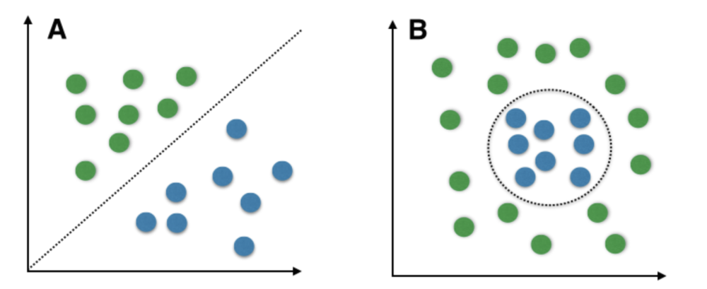
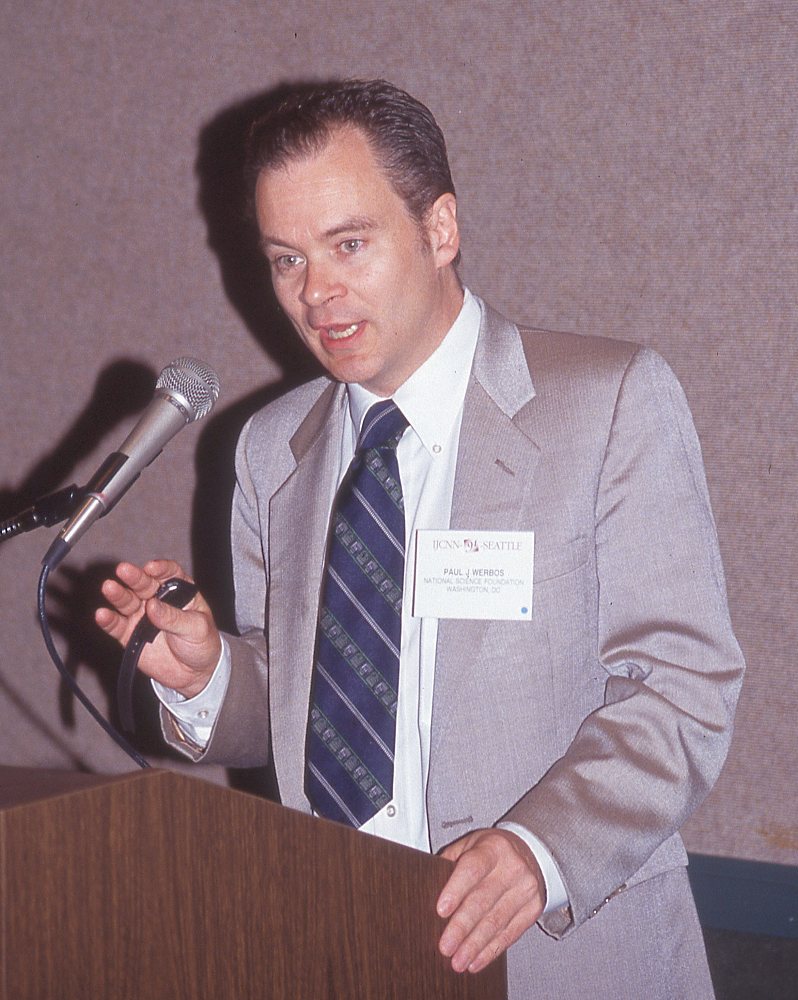
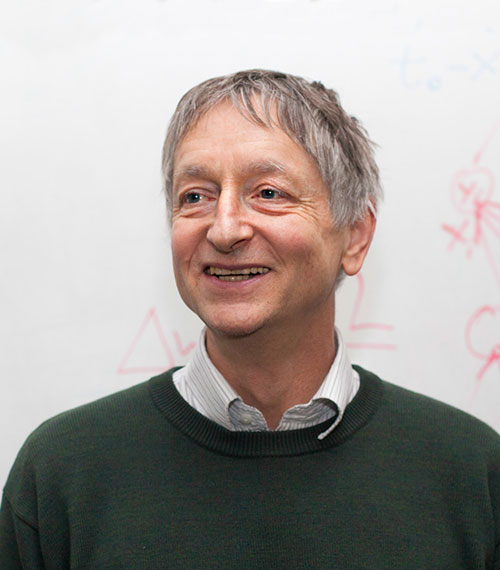

# 2. A tanítás algoritmusa: backpropagation #

Az első részben bemutattam a neuronhálózatok kutatásának kezdeti időszakát, melynek végén a kutatás tulajdonképpen zátonyra futott, mert nem jöttek a remélt eredmények. Vajon miért nem?

Utólag már látszik, hogy a problémát elsősorban az okozta, hogy két rétegnél mélyebb hálózatot a gyakorlatban nem sikerült betanítaniuk. (Hebb módszere többre nem volt képes.) Ez pedig csupán lineárisan elválasztható kategorizálást tud megvalósítani, vagyis olyanokat, ahol a bemenet/kimenet értékeket koordináta-rendszerben ábrázolva egyenes vonalakkal el lehetett választani az eseteket. (Szóval bizonyos eseteket meg lehetett vele oldani, másokat meg sehogysem.)

|  |
|:-------------------------------------------------------:|
|   Lineárisan szeparálható és nem szeparálható esetek    |

Ezen egy újabb fontos fejlesztés sem segített, melyet 1969-ben Kunihiko Fukishima alkalmazott először, hogy az addigi küszöb-aktiváció helyett megjelent a RELU (Rectified Linear Unit) aktivációs függvény. Itt a korábbihoz hasonlóan egy bizonyos küszöbértékig 0 maradt a kimenet, de a küszöböt elérve ez az adott érték jelent meg a kimeneten, tehát nem hirtelen ugrással egy 1-es. Az eddig fix 0 vagy 1 kimenet helyett az értékek egy folyamatos skálán mozoghattak.
https://en.wikipedia.org/wiki/Rectifier_(neural_networks)

1974-ben Paul Werbos amerikai tudós doktori disszertációjában bemutatta, hogy egy más területeken alkalmazott algoritmus alkalmas többrétegű neuronhálózatok betanítására is. A területtől azonban annyira elfordultak a kutatók, hogy ez gyakorlatilag visszhang nélkül maradt. Werbos eredményét nem ismerve 1985-ben Yann Le Cun és David Parker egymástól függetlenül újra felismerte ugyanezt. Ennek hatására született meg 1986-ban Rumelhart, Hinton és Williams tanulmánya, mely széles körben ismertté tette az általuk back-propagation-nek elnevezett módszert.

|  |  |  |  |
|:------------------------------------------------:|:-----------------------------------------------:|:-------------------------------------------------------:|:----------------------------------------------------:|
|                   Paul Werbos                    |                   Yann Le Cun                   |                     David Rumelhart                     |                   Geoffrey Hinton                    |

Hinton és Yann Le Cun a mai napig a terület legnagyobb szaktekitélyei, számtalan eredménnyel járultak hozzá a terület fejlődéséhez. Önállóan, illetve tanítványaikat segítve is. Yoshua Bengio-val együtt 2018-ban ők kapták a Turing-díjat, amelyet a számítástechnika Nobel-díjaként is aposztrofálnak. (1 millió dollár a jutalom. Hármukat szokták a Deep Learning keresztapjaiként emlegetni.)

A backpropagation algoritmus működése röviden a következő. Először meghatározzuk az eltérést egy adott bemenetre adott válasz, illetve az elvárt (ideálisnak tartott) érték között. Ezt az eltérést, vagyis a hibát pedig a hálózaton hátulról előlre végigfuttatjuk. (Ezért hívják backpropagation-nek, vagyis visszafelé terjesztésnek.) A visszaterjesztés során az aktivációs függvény deriváltját használják, ebbe táplálják be a kimenetet. (A derivált egy adott ponton az aktivációs függvény meredekségét adja vissza, így azt kapjuk meg, hogy melyik irányban és mennyire nagy lépésekben érdemes állítani a paramétereket. Ez a gradient descent eleme a backpropagation módszernek.) Tulajdonképpen meghatározzuk, hogy milyen értéknek kellett volna lennie az előző lépésben ahhoz, hogy a kívánt eredményt kapjuk. Majd minden paramétert egy icipicit ebbe az irányba léptetjük. (Mindezt aztán újabb és újabb tanítási példákkal rengetegszer megismételjük.)
 
A 80-as évek számítógépei azonban nem rendelkeztek kellően nagy számítási teljesítménnyel, és a betanításhoz szükséges hatalmas adatmennyiség sem állt rendelkezésre, így gyakorlati eredményre egészen 1993-ig kellett várni, mikor egy mintafelismerési versenyen nyert egy neurális hálózatot használó program. Ne feledjük, hogy a web is csak ekkoriban jött létre (1991-ben), és használata csak az 1990-es évek közepére terjedt el. (Én 1996-ban még nem láttam élőben internetet, pedig ebben az évben végeztem a főiskolán informatika szakirányon.) Ekkoriban nem léteztek nagy szöveges adatbázisok, nem volt fenn minden könyv vagy publikáció a neten. Alig voltak hírportálok, a szociális platformok, mint például a Facebook csak később jöttek létre.

Tehát nagyjából a 90-es évek közepétől kezdett gyűlni a digitális korpusz, de csak a 2000-es évtized hozta el azt, hogy ezek használható méretűvé duzzadtak, és a kutatók számára elérhetővé váltak.
