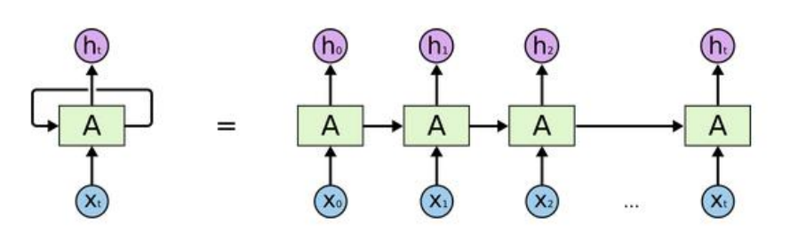
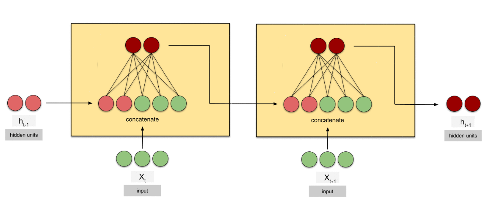
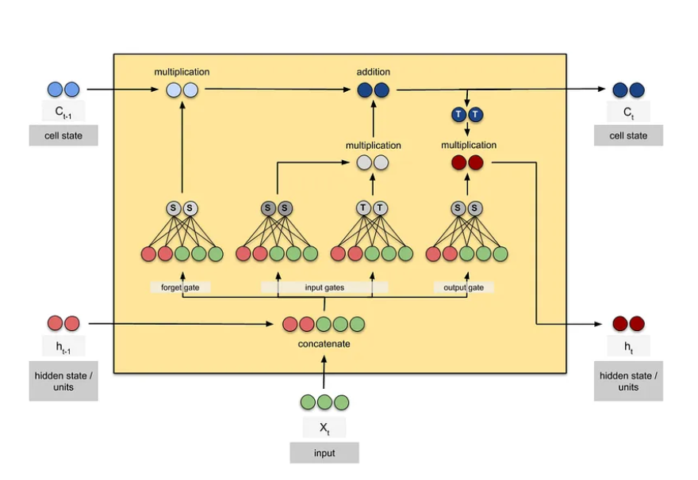

# 3. Visszacsatolásos hálózatok #

Az első részben bemutattam a neurális hálózatok kutatásának korai időszakát. A másodikban a backpropagation betanítási algoritmusról volt szó. Most a visszacsatolásos hálózatok következnek.

Akkor nevezünk egy hálózatot visszacsatolásosnak, ha egy neuron kimenetén megjelenő érték visszakerülhet a bemenetére. (Vagy közvetlenül, vagy más neuronok által módosított értékkel.) Tehát a neuronok összeköttetésében hurkok találhatók, nem csak simán előre irányú haladás. (A hurkok nélküli hálózatokat előrecsatolásos, vagyis feed forward hálózatoknak nevezik, rövidítve FFN. A visszacsatolásos neve angolul recurrent neural network, vagyis RNN.)

A visszacsatolás lehetőségét már 1943-ban felvetette a perceptronokat kiagyaló McCulloch és Pitts, és későbbi elméleti munkák is foglalkoztak vele. 1972-ben a japán Sunicsi Amari állt elő egy változattal, melyet ma Hopfield hálózatnak neveznek, ami tulajdonképpen az emberi memóriához hasonló működést tud produkálni. Ennek az a lényege, hogy a hálózat által kiadott eredményt újra beadjuk a hálózatnak, így az tulajdonképpen folyamatosan észben tartja.
https://en.wikipedia.org/wiki/Hopfield_network

Egy más jellegű visszacsatolásos hálózatot 1986-ban Michael I. Jordan tanulmánya tárgyalt először. Ez a megoldás szekvenciális adatok feldolgozására lett kitalálva, tehát olyan esetekre, mikor időben egymás után folyamatosan érkeznek bemenetek. Mondjuk beszéd, vagy videó képkockái, stb. Az architektúra nagyon egyszerű. A hálózat bemenete két részből tevődik össze. Egyik része az új elem a szekvenciában. A másik pedig a hálózat előző kimenete. Ez a két rész egyszerűen egymás mellé kerül. Induláskor pedig, mikor még nem volt semmilyen kimenete a hálózatnak, valamilyen kezdőértékkel töltődik fel ez a rész. A hálózat tehát újra és újra produkál egy kimenetet, ezek sorozata adja végülis a választ a bemenő adatok sorozatára. Jordan azt is megmutatta, hogy a backpropagation algoritmus ezekre is alkalmazható.
https://cseweb.ucsd.edu/~gary/PAPER-SUGGESTIONS/Jordan-TR-8604-OCRed.pdf

|  |          |
|:----------------------------------------------------:|:--------------------------------------------------------:|
|                  Michael I. Jordan                   | A közönséges visszacsatolásos hálózat időbeli felbontása |

Ez a legegyszerűbb visszacsatolásos rendszer, angolul vanilla (vagyis közönséges) visszacsatolásos hálózatnak nevezik, megkülönböztetve a komplexebb visszacsatolásos architektúráktól.

|               |
|:------------------------------------------------------------------:|
| Közönséges visszacsatolásos hálózat, időben egymás utáni két lépés |

Gondoljuk végig, hogy mik a közönséges visszacsatolásos rendszer hiányosságai! Bár lehet variálni azon, hogy mekkora részt tegyen ki az aktuális bemenet, és mennyi jöjjön vissza az előző kimenetről, de a legelső kimenet hatása az újabb és újabb bemenő adattal egyre inkább halványul. (Ez a vanishing gradient-nek nevezett probléma.) Egyszerűen abba a fix méretű adathalmazba, ami a hálózat bemenetén érkezhet, nem fér bele minden információ egy tetszőlegesen hosszú szekvenciáról, tehát ha túl sok elemünk van, a rendszer nem fog emlékezni a legelsőkre.

A másik korlát, hogy a rendszer pontosan ugyanannyi kimenetet produkál, mint ahány bemenetünk van. Képes tehát folyamatosan valamilyen információt szolgáltatni az aktuális bemenetről, például felismerni a kimondott hangokat. De más esetek kezelésére nem alkalmas. Ezért aztán szövegfeldolgozási jellegű feladatokkal itt nem is próbálkoztak.

A visszacsatolásos architektúrák közül az egyik legtöbbször használt megoldás az LSTM, vagyis long short-term memory. Ezekkel nagyon komoly sikereket értek el, ezért mesélek róluk, de a transzformer architektúrához vezető úton tulajdonképpen zsákutcának bizonyultak. (Annak fő újítása tulajdonképpen az LSTM megoldás kihajítása volt.) Ez persze nem jelenti azt, hogy ezeket a hálózatokat más területeken ne volna érdemes használni. És nem csak azt jó tudni, miért fordult ebbe az irányba a kutatás, az LSTM-en keresztül saját agyunkat is kicsit jobban megérthetjük.

|  |  |
|:----------------------------------------------------:|:------------------------------------------:|
|                   Sepp Hochreiter                    |       LSTM (Long short-term memory)        |

Minek a rövidítése az LSTM? Meglepő a név, abból áll, hogy long short-term memory. Vagyis hosszú rövid-távú memória. Most akkor hosszú vagy rövid? Ahhoz, hogy a nevet megértsük, egy kicsit új szemmel kell a visszacsatolásos neurális hálózatokra tekinteni. Ugyanis ha belegondolunk, egy visszacsatolásos hálózat memóriaként is tud viselkedni. Ráadásul az emberi memória működését pontosan ilyen módon képzeljük el!

Agyunkban kétféle módon tárolható információ. Van hosszú távú memóriánk, ami szinte bármeddig megőrzi tartalmát. És van rövid-távú, ami csak pár másodpercig. A hosszú távú memória agyunkban a szinapszisokkal valósul meg, vagyis az egyes neuronok közti összeköttetés tárolja az információt. Ez a mesterséges neurális hálózatokban a paramétereknek felel meg, vagyis a neuronok bemenetein lévő súlyoknak, azaz szorzóknak. Ezek az értékek a hálózat betanítása során állnak elő, utána változatlanok. Nehéz elképzelni, hogy ez mitől memória. Hogyan jegyzik meg ezek a szorzók, hogy mikor volt a Mohácsi csata. Mert ugye az eltárolt szám nem 1526. Ez nem egyetlen paraméterben szerepel, hanem az egész hálózat, minden egyes neuron együttműködése adja vissza. Minden neuron dolgozik, és ha beadjuk a hálózatnak, hogy Mohácsi csata, az lesz a kimenet, hogy 1526. És nem azért, mert az egyik neuronba ez volt írva, és azt kellett előkeresni. Az információ elosztva, az összes neuron összes paraméterében együtt lett eltárolva. Én úgy képzelem el, hogy a paraméterek egy programkódot tárolnak, és ha a programot lefuttatjuk, az adja ki a végeredményt. Kell minden neuron a programkódhoz. Ha az egyik paraméter jelentősen megváltozik, a program már nem megfelelően, vagy legalábbis másként viselkedik. De az információ nem közvetlenül van eltárolva, hanem ilyen áttételesen. Persze ez csak egy hasonlat, nem kell szó szerint venni, de talán nem is áll olyan távol a valóságtól.

Tehát a paraméterek adják a hosszú távú memóriát. Betanítottuk a rendszert, már nem változtatjuk meg a paramétereket, minden információra tartósan emlékezik a hálózat, vagy legalábbis ugyanarra a kérdésre képes ugyanazt a választ adni. De hol bújik meg a rövid távú memória? Van talán egy külön szerv erre az agyban? Hát nincs. A rövid távú memória az az épp aktuális állapota az agynak. Vagyis a mesterséges neurális hálózatban ez a rejtett állapot, angolul hidden state. Ez azoknak az értékeknek az összessége, melyeket a neuronok kiszámítottak, és éppen továbbítják a következő neuronoknak. Namost ha nem lenne visszacsatolás az agyban, akkor ez az állapot folyamatosan változna. Valami információ bekerülne az agyba, mondjuk egy érzékszervünktől, és végigfutna az agysejtjeinken. Mindegyiknél csak egy pillanatra megjelenve. Nem is nevezhetnénk ezt memóriának, mert nincs tárolás, egyik fülünkön be, a másikon ki. De ha visszacsatolás van, akkor megoldható az, hogy folyamatosan körbe-körbe áramoltassunk egy bizonyos információt. Így amíg az odabenn köröz, addig van egy tartós hatása. Ha elengedjük, és már nem áramoltatjuk vissza a korábbi rétegekbe, akkor pedig kifut, és elfelejtjük.

A közönséges visszacsatolásos hálózatban megvan ez a körkörösség, mert a kimenetet újra visszaadjuk a bemenetre. Igaz, hogy az újabb kívülről jövő bemenetnek is kell helyet adni, tehát a korábbi információ szép lassan kimosódik. De van itt egy rövid ideig tartó emlékezet.

Namost az LSTM, a hosszú rövid-távú memória arra lett kitalálva, hogy ez a kimosódás ne történjen meg olyan gyorsan, vagyis a rövid távú memória egy kicsit hosszabb legyen. Ezen 1991-ben kezdett gondolkodni egy német kutató, Sepp Hochreiter, pontosabban ekkor készült el doktori disszertációjával, ahol a visszacsatolásos hálózatok elvesző gradiensével, vagyis lényegében folyamatosan szivárgó memóriájával foglalkozott. Az LSTM architektúra végleges változatát több finomítás után 1997-ben publikálta. A lényege annyi, hogy különféle kapcsolókkal (kapukkal) lehetővé teszi, hogy a rendszer viszonylag változatlanul visszaírja a kimenetet a bemenetre. Illetve a hálózat azt is megtanulja, hogy ezeket a kapukat mikor nyissa ki vagy csukja be.

Az LSTM egy egysége tulajdonképpen több hagyományos neurális hálózatot tartalmaz, és ezek vannak egy-egy függvény által szabályozott kapuval összekötve. Egy konkrét megvalósítás általában sok ilyen egységből áll. Tekinthetjük úgy, hogy egy ilyen egység egy olyan neurális hálózat, ami kevésbé felejti el, hogy milyen érték folyt át rajta korábban.

Mivel az LSTM agyunk hosszú és rövid távú memóriáját is elég jól szimulálja, elég sokan hittek benne, hogy ez az architektúra hozza majd el a nagy áttörést. És szépen lassan jöttek is az eredmények. 2004-ben szövegfelismerésre betanított rendszert építettek belőlük, tehát ami a hangot, a kimondott szavakat karaktersorozattá alakította. 2009-ben kézírás felismerést oldottak meg sikeresen. 2014-ben pedig angol-francia fordítást valósítottak meg.

Még korábban kitaláltak egy másik típusú visszacsatolásos hálózatot is, amely agyunk képfeldolgozási megoldását utánozza. Ezt konvolúciós hálózatnak nevezik. Rengeteg siker fűződik hozzájuk kép- és hangfeldolgozás esetén, de ennek részleteibe most nem mennék bele. Azért ide teszem Kunihiko Fukushima fotóját, aki 1980-ban ezt a neocognitron-nak is nevezett architektúrát kitalálta. Egyébként ő vezette be a RELU aktivációs függvényt is 1969-ben, már csak emiatt is megérdemli a kiemelést.

|  |
|:-------------------------------------------------------:|
|                   Kunihiko Fukushima                    |

Nyelvi feladatokra, például fordításra használtak közönséges visszacsatolásos, LSTM és konvolúciós hálózatokat is, ezekről a kutatásokról a következő részben mesélek.