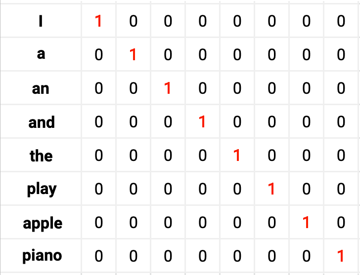

# 4. Út a használható neurális hálózatos fordításig #

Az eddigi részekben bemutattam a neurális hálózatok kutatásának korai időszakát, majd a backpropagation betanítási algoritmust és a visszacsatolásos hálózatokat. Most bemutatom, milyen út vezetett az első neurális hálózat alapú fordításokig.

Érdemes belegondolni, hogy a 80-as években a többség számára egyáltalán nem tűnt elképzelhetőnek, hogy egy neurális hálózat képes lehet megoldani egy olyan feladatot, mint amit most a ChatGPT esetén látunk. Maga az ötlet sem olyan triviális, hogy a gép folytasson, vagy generáljon a semmiből egy szöveget. Szerintem a legtöbben pár hónappal ezelőtt még nem is gondoltuk, hogy ilyen célra program készíthető. Szövegek esetén az egyik leggyakoribb felmerülő feladat a fordítás. Úgyhogy nem meglepő, hogy eleinte legtöbbször ezzel próbálkoztak. Persze léteztek korai csetelő programok is, melyek hagyományos algoritmussal próbáltak beszélgetést imitálni. Tehát volt igény ilyesmire is. De a hagyományos algoritmusok gyenge teljesítményét megtapasztalva, vagy kár csak elgondolkodva azon, hogy milyen sok információt, háttértudást hasznosítunk egy beszélgetés során, és azt milyen összetett módon tesszük, hát a többség azt gondolta, hogy először általános intelligenciát kell tudni valahogy építenünk, és majd utána kezdhetünk neki efféle szöveges feladatoknak.

A neurális hálózat alapú fordítás a 60-as években gyakorlatilag kudarcba fulladt, nem működött. Ehelyett a hagyományos algoritmusok használata kapott lendületet, ahol szavankénti fordítás után minden egyes nyelvtani szabályt vagy kivételt le kellett programozni. Ez nem volt teljesen használhatatlan, de egyre jobban látszott, hogy ezzel a módszerrel még évszázadokon keresztül kellene írni egy programot, mire minden kifejezést és esetet megfelelően kezelni tud. De egy akkora programot már nyilván a programozók se volnának képesek átlátni.

Nagyot lendített a gépi fordításon a statisztikai jellegű algoritmusok elterjedése. Ilyenkor óriási szövegkorpusz elemzése alapján, szavak bonyolult kategóriákba szervezésével és ügyes keresési megoldásokkal operálnak. Ezzel a módszerrel viszonylag pontos fordításokat sikerült a 90-es, 2000-es években produkálni, bár a fordítás tele volt hibával, félreértésekkel. A többértelmű esetekkel kevésbé boldogult, nem tudta megfelelően kihasználni a szövegkörnyezet segítségét, tehát nem értette a kontextust, hogy pontosan miről van szó. És stilárisan is elég béna mondatok jöttek létre.

Neurális hálózatokat eleinte a statisztikai rendszerek felturbózására vetettek be. Bizonyos kategorizálásokat végeztettek el velük, vagy több féle fordítási lehetőség közül segítettek választani ezek a módszerek.

A teljesen neurális hálózat alapú fordítás lehetőségében a legtöbben nem is igazán hittek. Pedig egyébként egyszerűen el lehetne képzelni egy ilyet. Képzeljünk el egy neuronhálót, ahol a bemenetre beadunk egy szöveget. Mondjuk betűnként, minden betű ASCII kódjával, tehát bemegy egy számsorozat, a mondat egészben az egyik nyelven. És a hálózatnak meg kellene tanulnia, hogy a kimenet adjon ki egy másik mondatot, a másik nyelvre való fordítást. Hát elképzelni könnyű, de ez a gyakorlatban nem működik. Talán egy iszonyatosan gigantikus hálózat képes lehetne erre is, de ettől még ma is messze járunk. Az biztos, hogy nem hatékony így csinálni.

De mi a probléma ezzel? Miért nehéz ez egy neurális hálónak, és miért tud megoldani más jellegű dolgokat? A probléma gyökerét leginkább Yoshua Bengio és kutatótársai kapargatták meg. Az a gond ezzel, hogy egy neurális hálózat nem szereti az ennyire konkrét értékeket. A diszkrét, egymástól ugrásszerűen különböző értékek helyett jobban boldogul a folyamatosakkal. Ha 65 helyett 66 lesz az eredmény, akkor már A helyett B lesz. Ha mindegyik szám csak pár értékkel megy mellé, rendszertelenül, nem kapunk értelmes eredményt. De a feldolgozandó adathalmazból az információ kinyerése sem egyszerű. A különféle bemenetek teljesen eltérőek. Akkor is egy teljesen más számot kap a rendszer, ha egyébként lenne valami hasonlóság egy másik értékhez. Mondjuk a nagy "A" és a kis "a" 65, illetve 97 ASCII kódolásban. Még ha a szöveget mondjuk kisbetűsítenénk, hogy ennek már nincs jelentősége, akkor is az van, hogy az egyes betűk közt nincs hasonlóság jelentésben. Nem tud a rendszer általános következtetéseket levonni. Nincs a bemenet szerkezetében semmi, ami a jelentés megértését segítené.

Bengio és társai 2001-ben és 2003-ba publikálták tanulmányaikat, ahol egy aprónak tűnő ötlettel kísérleteztek. A szöveget szavakra bontva táplálták a neuronhálózatba, de nem egyetlen számként, hanem minden szó egy hosszú számsorozatból, vagyis vektorból állt. Ezen belül a legegyszerűbb lehetőséget választották, vagyis a számok csupán 0-ák vagy 1-ek lehettek, és minden szó csak egyetlen 1-est tartalmazott, az összes többi érték 0 volt. Összeállítottak egy közepes méretű szótárat, a leggyakoribb pár ezer szóval. Ezeket ismerte csak a rendszer. Minden szónak egy olyan hosszú vektora volt, ahány féle szó szerepelt a szótárban. Az első szónak az első pozíción volt 1-ese, a többi 0. A második szónak a második pozíción, és így tovább.

|  |   |
|:--------------------------------------------------:|:-----------------------------------------------------------:|
|                   Yoshua Bengio                    | Szavak vektorokká kódolása (Itt csak 8 szó van a szótárban) |

A szavakat nem véletlenszerűen helyezték el a szótárban, hanem valamilyen jelentéssel összefüggő rendszer szerint sorba rendezve szerepeltek. Már amennyire ez sikerült - nyilván nem tökéletesen, de adhatott valami segítséget. De ez a megoldás nem csak a jelentés jobb megragadásában, vagyis a bemeneti oldalon volt hasznos, hanem a kimeneten is. A hálózat által produkált válasz ugyanis nem egy konkrét szó vektora volt, tehát nem egy olyan eset, hogy mindenhol 0 jött, és csak egyetlen helyen 1-es. (Elég nehéz is lenne összehozni ezt egy neurális háló szorzóit állítgatva.) A kimenet minden egyes száma többnyire nullától különböző értéket vett fel. De az eredményt lehetett úgy értelmezni, hogy az a hálózat válasza, amelyik pozíción a legnagyobb érték szerepelt. Ezzel tehát kevésbé szigorú, kevésbé szögletes használati mód vált lehetővé, ki lett kicsit simítva, folyamatossá téve mind a bemenet, mind a kimenet. És ezt jobban szereti egy neurális háló.

További előny volt, hogy nem csak egyetlen szó lehetett a válasz, hiszen így a kimenet tulajdonképpen azt is megmondja, hogy mely szó mennyire jó válasz. Lehet választani több, hasonlóan jó lehetőség közül.

A módszert először részfeladatok elvégzésére használták. Például beszédfelismerés esetén, mikor már az akusztikai információ feldolgozásra került egy másfajta rendszer által, amely több lehetőséget talált, hogy vajon mi lehet a hallott kifejezés. A neurális hálózatnak ezen lehetőségeket kellett pontoznia, hogy mennyire értelmesek, így javítva az eredményen.

Fordításra a legelső megvalósítást 2012-ben publikálta Holger Schwenk. Itt a lehető legegyszerűbb előrecsatolásos hálózattal dolgoztak. Beadtak egy mondatot a bemenetre, és a hálózat kimenete kiadta a lefordított mondatot. A mondat maximum hét szóból állhatott. (Ha kevesebb szóra volt szükség, csupa nullákat kellett beadni.) A szótárban 16 ezer különböző szó volt, tehát hétszer ennyi bemenő értékkel kellett dolgozni. A betanítást 7 millió angol-francia fordítási példával végezték.

|  |
|:---------------------------------------------------:|
|                   Holger Schwenk                    |

Tehát egy egyszerű neurális háló, plusz Bengio apró ötlete, hogy a szavakat 0-ákat és 1-eket tartalmazó vektorral kódolják el, máris egy működő fordítóprogramot eredményezett. Bizonyára nem volt ez tökéletes, de nagyjából megtalálta a megfelelő szavakat. Nem mondom, hogy ezt akár a 60-as években is megcsinálhatták volna, mert akkor bizonyára nem állt még rendelkezésre kellő számítási kapacitás, és nyilván 7 millió fordítás sem volt meg digitálisan. De a 90-es években valószínűleg már nem lett volna kivitelezhetetlen. Mégis, kellett még durván két évtized, mire idáig eljutottak, csak azért, mert hiányzott egy apró ötlet.

Persze azt is könnyű belátni, hogy ez a megoldás nem tökéletes. Az egyik gyenge pont a kötött hosszúság, vagyis hogy fixen hét szóról hét szóra fordítunk. És a használható szavak mennyisége, vagyis a szótár mérete is kötött. Ráadásul a bemeneti módszer nagyon pazarló, mert egy hosszú vektorban kevés információt tárolunk csupán el, egyetlen 1-est. És igaz, hogy elvileg a hasonló szavak egymás mellé kerültek, de a szavak közti hasonlóság nem egy egydimenziós dolog, tehát nem lehet igazán jól az összes szót egyetlen hosszú láncba fűzni, ahol minden elem valamilyen jelentéssel összefüggő módon hasonlít a szomszédjához.

Az utóbbi problémán többen is dolgozni kezdtek, de nagyjából egy évtized kellett, mire rátaláltak az első igazán jó megoldásra. Az nyilvánvaló, hogy valahogy több információt kell betenni a szavakhoz tartozó vektorba. Csak az a kérdés, hogy pontosan micsodát. Tomas Mikolov és társai 2013-ban publikálták a Word2Vec módszert, ami előállította ezeket a vektorokat. Kétrétegű neuronhálózatot használtak, amit nagy szövegkorpuszon tanítottak be. A bemenetre tett szövegrészletből mindig kihagytak egy szót, és az a hiányzó szó volt az elvárt kimenet, amitől való eltérés alapján hangoltak a paramétereken. (Természetesen backpropagation megoldással.) A tanítás során minden szót a Bengio-ék által kitalált módszerrel, vagyis a csak nullákat és 1-et tartalmazó kódolással táplálták be. De miután véget ért a betanítás, megnézték, hogy milyen kimeneti vektort ad a rendszer minden egyes szó esetén. És ezek a kimeneti értékek kerültek be egy új szótárba.

Így tulajdonképpen a szavak egy többdimenziós térben lettek elhelyezve. (Annyi dimenziós, ahány számból áll a vektor.) És a vizsgálatok során azt találták, hogy a hasonló szavak ebben a sokdimenziós vektortérben egymáshoz közel helyezkednek el. (Három dimenzió esetén ezt még el is tudjuk képzelni, ha három elemű lenne a vektor. Egy 3D-s koordinátarendszerben, vagyis itt a térben a hasonló szavak közel lesznek egymáshoz. Csak itt több száz számról, több száz dimenzióról van szó.)

Ezt a sokdimenziós vektoros módszert hívják word embeddingnek, vagyis szó-beágyazásnak. (Mondhatjuk, hogy a Bengio féle, 0-ákat és 1-et tartalmazó vektor is az volt, csak a legegyszerűbb esete.)

Ha egy neuronhálózatot úgy tanítanak be, hogy a bemenetre ezen a módon elkódolva tesszük a szöveget, a hálózat sokkal könnyebben meg tudja tanulni a számára kitűzött feladatot. Több információt kap egy-egy szóról, nem csak annyit, hogy hanyadik volt a szótárban.

|  |
|:--------------------------------------------------:|
|                   Tomáš Mikolov                    |

A mai architektúrák esetén nem Mikolov Word2Vec megoldását használják már, de végeredményben ahhoz hasonló vektorokkal dolgoznak.

A Word2Vec jelentősége azonban túlmutat a vektorokon. Megnyitotta ugyanis az utat a generatív mesterséges intelligencia felé, amikor a feladat nem fordítás, hanem szöveg generálása, folytatása. Ugyanis ahogy láttuk, itt egy nagy szövegkorpuszon haladt végig a feldolgozás, amiből mindig mutattak egy részletet, egy szót kivéve. Ez a szó lehet a közepén, de akár a végén is, és akkor tulajdonképpen a rendszer a következő szót kell megtippelje.

Voltak már hasonló próbálkozások korábban is, felmerült például, hogy ilyesmit tömörítésre használjanak. Tehát egy algoritmus kell, ami megtippeli a következő elemet. Ha elég nagy arányban meg tudja tippelni, akkor nem kell letárolni a következő elemet, mert kiolvasáskor is megtippelhető. Csak akkor kell plusz információ, ha tudjuk, hogy az algoritmus rosszul tippel ott. Tehát Mikolovék ötlete sem előzmények nélküli volt, de mindenképpen nagy hatással volt a nyelvi feladatokon dolgozó kutatók gondolkodására. 

Az ilyen jellegű betanításnak a másik hatalmas előnye, hogy a szöveget nem kell emberi munkával előállítani, vagy átnézni. Egyszerűen óriási szövegmennyiség kell, amiből automatikusan ki lehet venni, hogy mi a bemenet, és mi az elvárt kimenet. A rendszer tehát emberi beavatkozás nélkül maga képes tanulni. Nem kell mondjuk mondatpárokat keresni, ahogy az fordítás esetén szükséges. Mivel eddigre hatalmas mennyiségű digitális szöveghez hozzá lehetett férni, tárva volt az ajtó a generatív mesterséges intelligencia fejlődése előtt.

Végezetül megemlítek egy kisebb jelentőségű újítást, ami a fix méretű szótár problémáját orvosolta. Bármilyen sok szót is teszünk be a szótárunkba, biztos lesznek hiányzóak. Megoldható volna, hogy betűnként adagoljuk a szöveget, és akkor csak annyi féle elemmel kell dolgozni, ahány betűt megengedünk. Ez azonban nem előnyös, mert így a neuronhálózat alig tudja kikövetkeztetni a szövegben rejlő tartalmi rendszert.

Részmegoldás, ha irgalmatlanul nagy, több százezer szót tartalmazó szótárral dolgozunk. (Ezt alkalmazták is, de még így is maradnak ismeretlen szavak.) Főleg, ha soknyelvű a rendszer. Az eddigi legjobb megoldás a byte-pair encoding, ami a szavak és a betűk közt félúton áll, vagyis szavak és szó-részletek, valamint betűk vegyesen reprezentáltak. (2015, Sennrich, Haddow, Birch.) (A byte-pair encoding (BPE) eredetileg tömörítési eljárás volt.)
