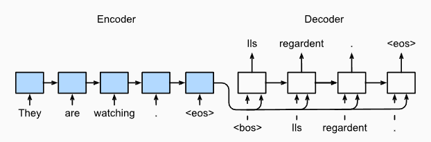
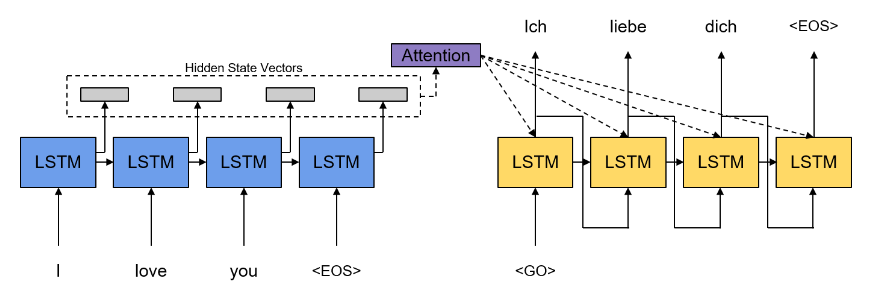

# 5. Encoder-decoder architektúra és attention mechanizmus #

Az eddigi részekben bemutattam a neurális hálózatok kutatásának korai időszakát, majd a backpropagation betanítási algoritmust és a visszacsatolásos hálózatokat. Az előző részben láttuk, ahogy a word embedding trükkje elvezetett az első használható fordításokig.

Egyetlen komoly probléma állt csak a fejlődés útjában. Hogy hogyan lépjék át a fix méret problémáját. Schwenk megoldása ugyanis hét szó bemenetet tudott kezelni, amit hét szóra fordított. Miképp lehet ezt a kötöttséget meghaladni? Nos, a megoldás az enkóder-dekóder architektúra használata volt.

Neurális hálózatos fordításra (vagy bármilyen nyelvi feladat elvégzésére) az első enkóder-dekóder architektúrát Nal Kalchbrenner és Phil Blunsom készítette el 2013-ban. Itt is a Bengio által javasolt, 0-ákból és 1-ből álló vektort használták az egyes szavak reprezentálására. De egyszerre csak egy szót tápláltak be, majd újabb és újabb menetekben a következőt. Így tehát a bemenő szöveg hossza tetszőleges lehetett. Hogy a korábbi szavak hatása megmaradjon, az új szó mellett az előző kimenetet is újra a bemenetre adták. Az utolsó szó hatására előállt kimenet lett az enkóder végső kimenete. Ezt dolgozta fel a dekóder.

|   |  |
|:------------------------------------------------------:|:-------------------------------------------------:|
|                    Nal Kalchbrenner                    |                   Phil Blunsom                    |

Hogy a dekóder által generált válasz is tetszőleges hosszúságú legyen, itt is ugyanolyan módszert követtek. Az enkóder kimenetét beadták a dekóderbe, és annak eredménye csupán az első szó volt. Az újabb és újabb szavakat úgy kapták, hogy a kimenetet újra betették a bemenetre, és kaptak egy következő szót. Addig kellett ezt ismételni, míg a válasz egy speciális eredmény nem lett, ami azt jelezte, hogy vége a szövegnek.

Az enkóder és a dekóder is egy-egy konvolúciós neurális hálózat volt.

Ha belegondolunk, tulajdonképpen az enkóder és a dekóder is pontosan úgy működik, mint a közönséges visszacsatolásos hálózat.

|  |
|:---------------------------------------------------------------:|
|                    Enkóder-dekóder fordítás                     |

Igaz, hogy az enkóder-dekóder architektúra felszabadít minket a fix méretek korlátja alól, de behoz egy újabb problémát, amit a közönséges visszacsatolásos neurális hálózat esetén láttunk. Vagyis azt, hogy a legelőször betáplált szó hatása az újabb és újabb menetekben egyre inkább kimosódik. Ezért aztán az enkóder-dekóder architektúrát nem sima előrecsatolásos hálózattal oldották meg, hanem olyannal, aminek önmagában is van némi memóriája, vagyis visszacsatolásos hálózattal. Tehát túl azon, hogy a kimenetet a következő futtatáskor újra betettük a bemenetre, a használt hálózat önmagában visszacsatolást tartalmazott.

Bengio és munkatársai (Schwenk, Cho, Marrienboer, Gulchechre, Bahdanau, Bougares) szintén egy enkóder-dekóder megoldáson kezdtek dolgozni, amit 2014-ben publikáltak. Ők az LSTM-ből indultak ki, de hogy javítsanak a számítási teljesítményen, kifejlesztették annak egyszerűsített változatát, a GRU-t. (Ezt a megoldást nem önálló fordításra használták, hanem egy statisztikai rendszer részeként.)

Ugyanebben az évben kicsit később Sutskever és társai is előálltak egy LSTM-et használó enkóder-dekóderes fordító megoldással, amely minden korábbinál jobb eredményt produkált.

|  |  |
|:--------------------------------------------------:|:---------------------------------------------------:|
|                   Yoshua Bengio                    |                   Ilya Sutskever                    |

A jobb eredményt Sutskever egy apró trükknek tulajdonította. Mégpedig annak, hogy a lefordítandó mondatot hátulról előre adták be a rendszernek, arra gondolva, hogy a mondat első szavai fontosabbak. Ugyanis számukra is nyilvánvaló volt a közönséges visszacsatolásos hálózatoknál említett probléma, a vanishing gradient. Vagyis az, hogy ha hosszabb mondatokat adunk be a hálózatnak, a korábban mutatott szavak hatása egyre jobban halványul, hamarosan teljesen kimosódik. Sutskeverék megoldásában a legutolsó szavak mosódtak ki hamarabb, az első szavak hatása nagyobb volt. Ez angol bemenő szöveg esetén valószínűleg tényleg segít, de a problémát nem szünteti meg, csak kicsit csökkenti.

Hogy mi az igazi probléma, azt megintcsak Bengio csapata találta meg. Bahnadauval és Cho-val együtt ők hárman még ugyanebben az évben, 2014-ben publikálták is rá a megoldást, az attention mechanizmust.

|  |  |
|:--------------------------------------------------:|:-----------------------------------------------------:|
|                   Dzmitry Bahdanau                    |                   Kyunghyun Cho                    |

De mi is az igazi probléma? Hát az, hogy hiába van bármilyen memóriája a neurális hálózatnak, a kimenete egy fix méretű vektor. Ha csak két szóra kell emlékeznie, vagy ha kétezerre, ugyanolyan hosszúságú vektor lesz az eredmény, amit aztán a dekódernek egy másik nyelvre kell fordítania. Nyilván nem férhet ebbe a fix méretű vektorba elég információ tetszőlegesen hosszú bemenő mondatról.

De hogyan segít ezen az attention mechanizmus? Úgy, hogy hagyományos memóriát használva minden egyes kimenetet eltárolunk. És a dekóder nem csak egyetlen, hanem az összes köztes eredményt is használhatja, amit az enkóder produkált. Már csak azt kell megoldani, hogy hogyan használja ezt, mert a dekódernél is fix méretű vektor van. A megoldás az, hogy a sok eltárolt kimenetet úgy kell egymásra helyezni (összeadni), hogy bizonyos szavak eredményét fontosabbnak tartjuk, nagyobb figyelmet szentelünk neki, mint másoknak.

|  |
|:-------------------------------------------------------:|
|             Bahdanau attention mechanizmus              |

Ezt a mechanizmust Bahnadau-attention-nek nevezik, mert ő volt a tanulmány első szerzője.

A következő, egyben utolsó részben magáról a Transformer architektúráról lesz szó.
