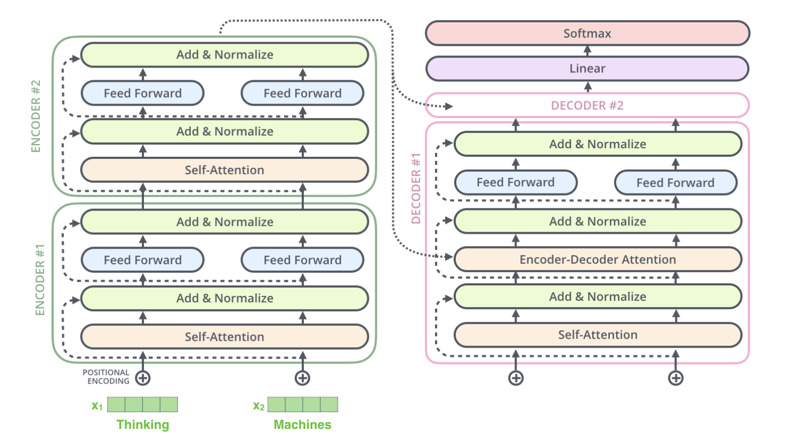
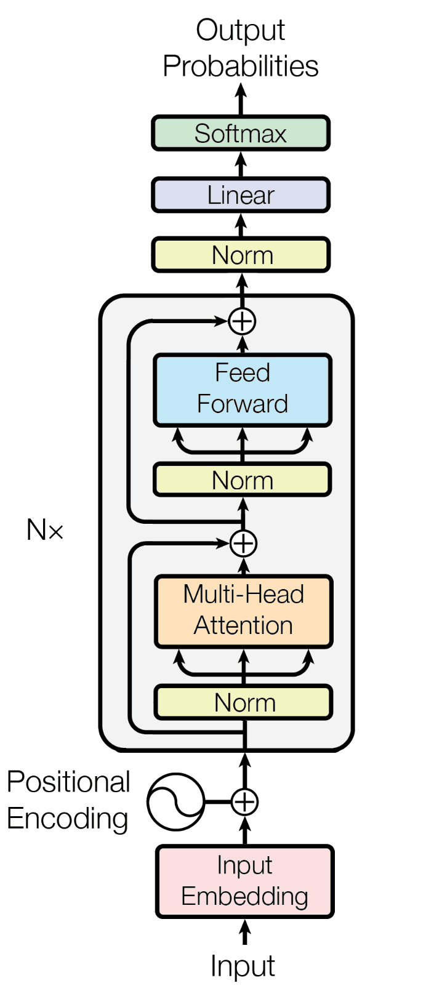
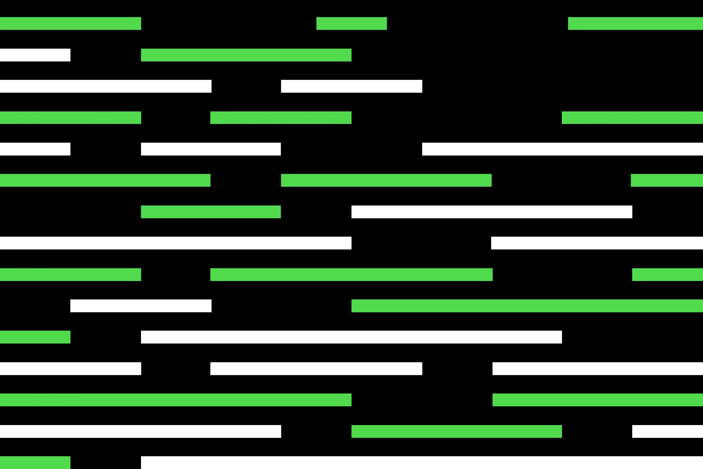
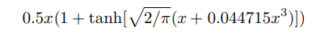
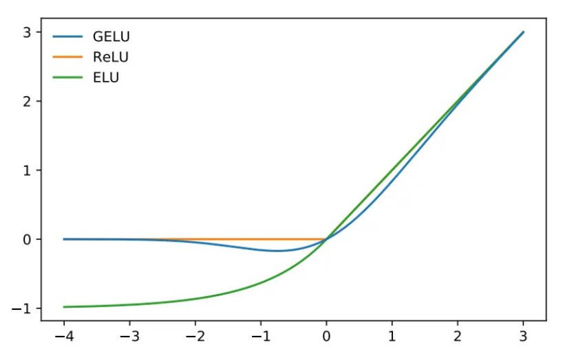

# 6. Transformer #

Az eddigi részekben bemutattam a neurális hálózatok kutatásának korai időszakát, majd a backpropagation betanítási algoritmust és a visszacsatolásos hálózatokat. Láttuk, ahogy a word embedding trükkje elvezetett az első használható fordításokig, majd az enkóder-dekóder architektúra és a Bahdanau-attention megoldotta, hogy változó hosszúságú szövegeket is kezelni lehessen. Nézzük, mi hiányzott még, hogy megszülessen a Transformer architektúra! 

Az előző részben tulajdonképpen már minden fontosat összeszedtem. Láttuk, a közönséges visszacsatolásos hálózat nagy hátrányát, hogy az újabb és újabb menetekkel a korábbi bemenetek hatása szép lassan kimosódik. Emiatt használt mindenki önmagában is memóriával rendelkező neurális hálózatot, konvolúciósat vagy LSTM-et, GRU-t. Emiatt trükközött Sutskever csapata azzal, hogy visszafelé adta be a szavakat. És ez ösztönözte a Bahdanau attention mechanizmus megszületését is. A Transformer architektúra létrehozásakor tulajdonképpen azt ismerték fel, hogy nem kell a memóriával rendelkező hálózat, nem kell a visszafelé beadogatás trükkje, önmagában az attention mechanizmus mindent meg tud oldani. Ezért is adták a tanulmányuk címének azt, hogy "Attention Is All You Need", vagyis "Figyelemre van csupán szükség".

A fő motivációt ehhez a felismeréshez az adta, hogy a jobb eredmény elérése érdekében a korábbiaknál nagyobb hálózatokat szerettek volna építeni. A visszacsatolásos hálózatok, mint a konvolúciós és az LSTM azonban nagyon számításigényesek, mert az egyes lépések kevéssé párhuzamosíthatók. A sima előrecsatolásos hálózat viszont jóval egyszerűbb eset. Egyszerű vektor-mátrix szorzásból áll a számítás, amely jól szétválasztható sok vektor-vektor szorzásra. A többmagos processzorok, illetve a sok adaton ugyanolyan műveletet egyidőben elvégezni képes grafikus processzorok (GPU) jól kihasználhatók volnának itt.

Mindezt a Google Brain csapata valósította meg, akik a tanulmányt 2017-ben publikálták.

|  |  |  |  |
|:-----------------------------------------------------:|:---------------------------------------------------:|:-----------------------------------------------------:|:-------------------------------------------------:|
|                    Jakob Uszkoreit                    |                   Ashish Vaswani                    |                   Illia Polosukhin                    |                   Noam Shazeer                    |

Itt is enkóder-dekóder architektúrát alkalmaztak, és az attention mechanizmus lépései is megegyeztek a Bahdanau-attention lépéseivel. Annyi fejlesztés történt ebben a tekintetben, hogy bevezettek egy self-attention lépést is.

Az eredeti Bahnadau-attention a dekóderben működött, ahol az volt a feladata, hogy az enkóder által eltárolt sok vektor közül kiválassza a szerinte legfontosabbakat, és azt a néhányat használja csak, amire érdemes figyelmet fordítani. (Mindet nem használhatja, mert nem fér bele az egész egyetlen vektorba.) Ez tehát a dekóderben működő figyelem volt, ami az enkóder adataira figyelt. Nem önmagára, hanem egy másik részegységre.

A Transformerben is van egy pontosan ugyanilyen lépés. De emellett pluszban az enkóderben és a dekóderben is van egy self-attention lépés, vagyis önmagára való figyelés. Ilyenkor az enkóder azon adatokra figyel (azokat használja), melyeket saját maga tárolt el a többi tokenről. És a dekóder is ugyanezt csinálja, a saját maga által eltárolt adatok alapján.

Így aztán nincs szükség arra, hogy az enkóder kimenetét a következő lépésben újra beadjuk a bemeneten. Ez a visszacsatolás ki lett véve a rendszerből. És a dekóder oldalon sincs rá szükség.

|  |
|:---------------------------------------------------------------:|
|                           Transformer                           |

Hasonló maradt a feldolgozás sorrendje. Tehát a bemenő szavakat egyesével beadtuk az enkódernek. De az újabb és újabb menetek nem mosták ki a korábbiakat, minden el lett tárolva. És minden menet figyelni tudott az addig beadott szavakra. De csak azokra fókuszált, amik szerinte ebből fontosak voltak.

A dekódert is hasonló iterációval használtuk újra és újra. Beadva neki az előző kimenetet bemenetként. De megintcsak megvolt minden korábbi feldolgozásról minden szükséges információ hagyományos módon eltárolva, és azok közül szemezgetve, súlyozva fel lehetett használni bármelyiket.

Az attention mechanizmusban szerepelt egy további fejlesztés is, a multi-head megoldás. De ennek oka csak a jobb párhuzamosíthatóság volt.

A Google Brain részleg fél év múlva előrukkolt egy módosított Transformerrel, amelyet már nem fordításra fejlesztettek, hanem egyszerűen csak a szöveg folytatására. Itt tehát nem volt szükség enkóderre és dekóderre is, elég volt egyetlen komponens. (Ezt dekódernek hívják, de tulajdonképpen ellátja az enkóder funkciót is: feldolgozza a bemenetet. Sőt, igazából az enkóder szerkezetével egyezik meg, mert csak self-attention van benne, hisz nincs is másik komponens, amire irányulhatna a figyelem.)

|  |
|:--------------------------------------------------------------:|
|            Csak dekódereket tartalmazó transformer             |

A csak dekóderes változatot természetesen nem egy nyelvpárra tanították be, hanem a következő szót (tokent) kellett mindig megtippelnie. 

A megoldás mindenkinek felkeltette az érdeklődését, így az OpenAI is azonnal nekilátott, hogy lemásolja a csak dekóderes Transformert. (A csak dekóderes változat 2018. január végén jelent meg, 2018. júniusában pedig kész lett a GPT-1, kompletten letesztelve, tanulmányozva, publikációstul. Persze nem olyan nagy csoda, mert a csapatban volt a már tapasztalt Sutskever is.)   

Ilyenkor szokás azt mondani, hogy "a többi történelem". Nem tudom miért, mert a korábbiak is azok voltak, a többi meg ahhoz képest inkább a jelen. :-) De valahogy mégis ide passzol. Szóval a többi történelem. 2019-ben kijött a GPT-2. 2020-ban a GPT-3, majd a következő évben annak jobban betanított, instrukciókra jobban reagáló változata. 2022. vége felé a ChatGPT. (Ez is csak betanításban fejlődött.) 2023. márciusában pedig megjelent a GPT-4.  

Ha esetleg nehezen volt követhető a fejlesztések sora, megpróbálom egy hasonlattal elmagyarázni. Az egyszerűség kedvéért vegyük a csak dekóderes megoldást, tehát ahol annyi a feladat, hogy megkapunk egy szöveget, és hozzá kell tenni egyetlen új szót. (Ezt aztán lehet ismételni bárhányszor.)

Nem tudok arról, hogy erre használtak volna fix méretű neurális hálót (csak fordításra), de tegyük fel, hogy van egy ilyen. A hasonlatomban ez olyan, mintha lett volna egy hangrögzítőnk, amivel felveszünk egy mondatot. Idősebbek mondjuk képzeljenek el egy rövid darab magnószalagot. Ezt a rendszer egyben, egy menetben feldolgozta, és az eredményt, egy új szót lementett a kimeneti szalagra. Ez a következő szó. Kész. A gond ezzel az, hogy mondjuk van egy hét szó hosszúságot befogadni képes rendszerünk, ami nyilván nem lesz képes több ezer szavas szöveggel boldogulni. 

A közönséges visszacsatolásos megoldás úgy működik, hogy egy jóval rövidebb szalag van, amire csak egy szó fér rá. Rámondjuk az első szót, a rendszer ezt feldolgozza, és erre a bemeneti szalagra rámond valamit, amit erről gondol. Tehát a szalagon most ott van két szó, mintha két ember egyszerre beszélt volna. Rámondjuk a második bemeneti szót (most már három hang van a szalagon), amit megint feldolgoz a rendszer, és ezt is rámondja a szalagra. Egy idő után egyre több hang lett egymásra felvéve. Tegyük fel, hogy az utolsó szavak mindig hangosabban hallhatók, a régebbiek pedig egyre halkulnak. Pár menet után a régebbi szavak szinte már nem is hallatszanak, csak mint egy zaj. Amikor rámondtuk az utolsó szót, a rendszer azt még jól hallotta, de a korábbiakat jóval kevésbé érti. Mond egy választ, amit erről gondol, ami lehet a következő szó (csoda, hogy tud ilyet), de a bemenet elejét nem igazán használta fel ehhez.

Az attention mechanizmus annyit változtat ezen, hogy a bemenet mindig tisztán az adott szó. Azok feldolgozásakor pedig mindig elmenti egy kis gyűjteményben, hogy arról a szóról mit gondol. Hogy mi a gondolat, ahhoz a korábbi szavakat is tekintetbe veszi. És ez nagyon hasonló ahhoz, ahogy korábbi megoldásoknál láttuk, vagyis előállítjuk ezt a sok szó egymásra rakását tartalmazó felvételt. De nem az összes korábbi szót tesszük rá, csak mondjuk a legfontosabb tizet. Eldönti valahogy, hogy szerinte mik voltak a legfontosabbak. Lehet, hogy az előző pár szó, de lehetett több bekezdéssel korábbi is. (Igazából a többit is rámenti, de azokat jóval halkabban.) És a neurális hálózat ez alapján a bemenet alapján ad választ.

Az attention mechanizmus tehát egy kicsit olyan, mintha a régi analóg magnószalagokat lecseréltük volna egy digitális hangstúdióra. Minőségromlás nélkül pakolhatunk bármilyen hangot egymásra. Csökkentettük a zajt. Egy neurális háló tanulta meg, hogy szerinte mit érdemes tekintetbe venni. Az attention mechanizmus csak annyi, hogy elkészíti ezt a tiszta felvételt, és azt adagolja be a fő neurális hálózatnak, ami aztán megállapítja, hogy mi legyen a következő szó.

Nem feltétlenül biztos, hogy ez a legjobb megoldás, ami kitalálható. De ez most egy egész jól működő megoldás, ami ráadásul viszonylag hatékonyan kiszámítható. Nem kell egy olyan hatalmas neuronhálózat, ami egy menetben egy hosszabb bemenetet fel tud dolgozni. (Az exponenciálisan több számítást igényelne, mint ez a keskenyebb, egyszerre egy szót feldolgozó, több menetben futtatott változat.) A digitális stúdió hagyományos memóriában (RAM-ban) tárolja el a korábbi gondolatait, nem neuronokkal, vagyis nem pontosan a biológiai agyat másolja. Inkább olyan, mintha az agyba beültetnénk egy csipet.

Mivel itt elég jól érthető, megemlítem még, hogy van ezzel egy olyan probléma is, hogy a neurális hálózat, mikor beadjuk neki ezt a sok szó egymásra mondását tartalmazó felvételt, meg kelltudnia állapítania a szavak sorrendjét. Mert most sok szó egymáson van, de nem mindegy, hogy milyen sorrendben mondtuk ki őket. Erre való az úgynevezett "position encoding", ami valahogy belekódolja a hangokba a sorrendet. Mondjuk a fenti elképzelt esetben ez működhet az alapján, hogy mennyire hangosan hallatszik a szó. A leghangosabb az utolsó. De a valódi Transformer architektúránál nincs ez a halkulás, úgyhogy ott valami mást kellett kitalálni. Ennek több féle változata van, és itt vannak újabb fejlesztések is, de ennyi a lényegük.

A legelső részben nagyon röviden szó volt már az aktivációs függvényről. Ez azt határozza meg, hogy a neuron a bemeneteire érkező jelek összegéből hogyan számolja ki a kimenet értékét. Sokféle függvényt kipróbáltak, mindegyik alakja nagyjából hasonló: a kimenet egy bizonyos küszöbértékig nulla, vagy ahhoz közeli érték. Afölött pedig emelkedni kezd. Érdemes differenciálható függvényt választani, tehát amelyik folyamatosan változik, nincsenek benne ugrások vagy szakadások, mert akkor nagyon nehéz matematikailag levezetni a betanításkor használt műveleteket. A mostanában leggyakrabban használt függvényt, a "Gaussian Error Linear Unit" nevűt 2016-ban javasolták.

A GELU számítási módja a következő: 

|  |
|:---------------------------------------------------------:|
|        Három aktivációs függvény összehasonlítása         |

A Transformer architektúrát nem csak szöveges generatív feladatokra, csetelésre vagy fordításra használják, hanem számtalan más területen is kiváló eredményt produkál. Az OpenAI például elkészítette a DALL-E rendszert is, amely szövegből képet generál, tehát pár szóban leírjuk, mit szeretnénk látni, és a rendszer generál egy sokszor fotorealisztikus képet belőle. Hangokkal kapcsolatos alkalmazási területei is vannak, például hangmintákból megtanulhatja valakinek a hangszínét, amit képes leutánozni. De akár zenét is generálhat, különböző zeneszerzők vagy zenekarok stílusában. De újabb és újabb területeken is bevetik, például a Tesla önvezető autóiban is ott van. Az elmúlt 5 évben szinte minden mesterséges intelligenciás területen ez az architektúra nyújtja a legjobb eredményt.

Érdemes megemlíteni, hogy nem csak enkóder-dekóder, illetve csak dekóderes változata van, hanem csak enkóderes is. Ez található például a Google keresőmotorjában, amely feldolgozza ugyan a beírt szöveget, de a kimenete nem szöveg, hanem a keresési algoritmus által használt információ.

Miért ilyen sikeres? Több összetevője van, de a legfontosabb, hogy nagymértékű párhuzamosítással, gyorsan kiszámítható a válasza, így minden korábbinál nagyobb hálózatok építhetők belőle. És elkerül minden olyan problémát, amiben más architektúrák gyengék.

Foglaljuk össze, milyen elemek voltak szükségesek a Transformer architektúrához:
 - Neurális hálózat (1943, 1949, 1958)
 - Jobb aktivációs függvények (1969, 2018)
 - Backpropagation betanítás (1974, 1985, 1986)
 - Szekvenciális bemenet kezelése iterációval (1986)
 - Kellő méretű számítási kapacitás, nagy szövegkorpusz (90-es, 2000-es évek)
 - Embedding vektor használata (2001, 2013)
 - Hiányzó (vagy következő) elem megbecslésével való tanítás (next token prediction) (????, 2013)
 - Enkóder-dekóder architektúra (2013) - Opcionális
 - Attention mechanizmus (2014)
 - Enkóder-dekóder Transformer (2017)
 - Csak dekóderes Transformer (2018)

A Transformer architektúrán megszületése óta keveset változtattak. (Túl azon, hogy egyre nagyobb méretű rendszereket építenek.) De azért van pár részletkérdés, ahol kisebb fejlesztések történtek.

Nagyon nagy jelentősége van a betanítás részleteinek. Milyen adatokon és hogyan tanítjuk be a rendszert. Jellemzően először automatikus tanítással előtanítanak egy rendszert, majd azt részben emberi visszajelzések alapján finomhangolják. Az például, hogy a rendszer csetelni tud, vagy instruciókat értelmezni, ezen a finomhangoláson múlik. (Olyan példákat mutatnak neki, amiben instrukciók végrehajtása szerepel.)

Van még néhány részletkérdés, ahol a különféle Transformer megvalósítások igyekeznek kicsit javítani a teljesítményen. Például:
 - Pozíció beágyazás (Különféle algoritmusok.) Képesség hosszabb, vagy akár kötetlen hosszúságú szövegek feldolgozására
 - Jobb tokenizáció (nagyobb szótár, máshogy kiválasztott szavak (több nyelvű szavak is), vagy több szót tartalmazó tokenek)
 - Normalizáció helye (numerikus stabilitás)
 - Kisebb számítást igénylő finomítások: 16-bites modellek, sparse transformer

És egy nagyon izgalmas terület, amit már a GPT-4 megvalósított: Multimodalitás, vagyis különféle adatok kezelése. Itt a szöveg mellett képi bemenet lehetséges elvileg. (Bár ezt még nem próbálhatja ki földi halandó.)

Végezetül néhány gondolat általában a mesterséges intelligencia kutatásáról:

A fejlődés folyamatos volt, apránként haladt. Egy-egy lépés megtétele benne volt a levegőben, csak az volt a kérdés, hogy ki éri el hamarabb. Ahogy jöttek a komolyabb sikerek, egyre többen kezdtek vele foglalkozni, egyre komolyabb finanszírozással. A megvalósult rendszerek egyre jobban, immár elég látványosan közelítik az emberi képességeket. Az eredmények nem feltétlenül ezt a lineáris fejlődést követik: egy darabig szerények, de aztán beérik a gyümölcs, és gyorsul a fejlődés. Ez talán egy exponenciális görbe, melynek hosszú ideig lapos az íve, majd egy ponton meredeken kilő. (Ez Kurzweil tapasztalata és becslése.) De ha nem is gondoljuk törvényszerűnek, hogy a fejlődés exponenciális, és akár lassabb fejlődési szakaszokat is elképzelhetőnek tartunk, nagy valószínűséggel ezalatt is gyűlnek majd az apró haladások, melyeknek eredményeként később újra kilő a görbe.

Talán szükség van még néhány rafinált trükkre, melyről ma még fogalmunk sincs. De ezek vagy viszonylag gyorsan, az evolúció fokozatos haladásával valósultak meg az emberré válás során, tehát kicsi az esélye, hogy annyira összetett dolgokról legyen szó, amit képtelenség lenne leutánoznunk. Vagy ha evolúciósan jóval hosszabb idő alatt alakult ki, tehát esetleg mégis rettenetesen komplex dologról, dolgokról van szó, akkor a viszonylag egyszerű állatok is képesek lehetnek ezekre. Úgyhogy akkor meg emiatt tűnik valószínűnek, hogy nem vagyunk túlságosan távol az emberi szint elérésétől.

Az elérhető számítási kapacitás egyre nagyobb. Az agy méret-tartományának elérése is a belátható jövőbe került. Agyunk különféle képességek kombinációját valósítja meg, tehát tulajdonképpen sokféle funkció egybegyúrása. Valószínűleg különböző módon betanított hálózatok hibridje. Nem szükséges pontosan ugyanolyat csinálni, de ennek megfelelő szerkezetét kell a jövőben megtalálni, és megvalósulhat az általános mesterséges intelligencia. Ami a mennyiségi, sebességbeli fejlesztés miatt azonnal az emberi képességek meghaladását jelenti. Nagy esély van rá, hogy mindez még sokunk életében megvalósul.
